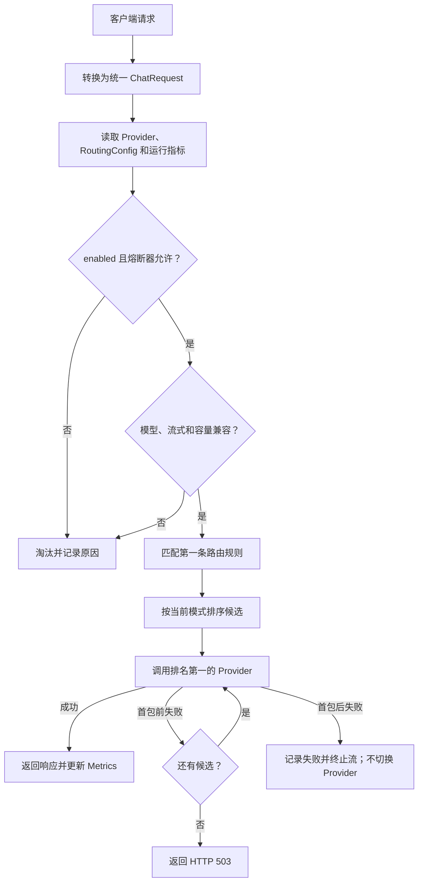
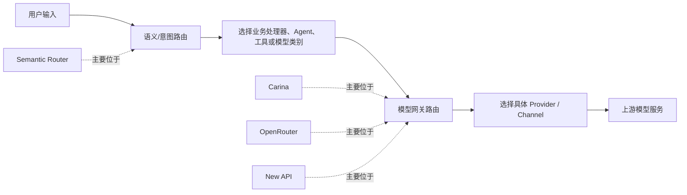

# carina 智能路由技术说明

> 文档状态：与提交 `0c75915` 的智能路由实现一致。适用对象：开发、测试、运维和需要配置路由策略的管理员。

## 1. 文档目的

本文说明 carina 智能路由的设计、配置模型、候选过滤、评分算法、运行指标、控制 API、故障处理和兼容策略，供开发、测试和运维排障使用。

智能路由建立在原有能力之上：请求仍先被转换为协议无关的 `ChatRequest`，路由器选择供应商后，再由对应 adapter 转换为上游协议。已有熔断、健康探测和故障切换语义保持不变。

### 一句话理解

智能路由做两件事：**先排除不能处理请求的供应商，再把能够处理请求的供应商按策略排好顺序**。Router 按这个顺序调用上游；第一个失败时继续尝试下一个。

它不是用另一个大模型判断问题类型的“语义路由”。当前实现是确定性的规则与指标路由，同样的配置和指标会产生同样的排序结果，因此容易解释和排障。

### 先记住四个概念

| 概念 | 作用 | 示例 |
| --- | --- | --- |
| Provider 元数据 | 描述供应商能处理什么 | 支持 `o3*`、支持流式、上下文 128K |
| Rule | 表达某类请求的约束和偏好 | 推理模型优先选择 `reasoning` 标签 |
| Metrics | 描述供应商近期实际表现 | 成功率、首包延迟、累计成本 |
| Policy | 将元数据、规则和指标组合为候选顺序 | `manual`、`rule`、`adaptive` |

## 2. 设计目标

- 默认不改变已有用户的 active-provider-first 行为。
- 根据请求模型、流式需求和容量限制排除不兼容供应商。
- 支持管理员通过规则表达业务偏好或硬约束。
- 使用真实请求的成功率、延迟、价格和优先级动态排序。
- 所有路由决策均可通过 preview API 解释。
- 智能路由失败不能绕过现有熔断和 failover 保护。
- 不记录 prompt、响应正文、API Key 等敏感内容。

## 3. 代码结构

| 文件 | 职责 |
| --- | --- |
| `carina/models/__init__.py` | 路由模式、规则、权重、供应商能力和预览请求模型 |
| `carina/routing/policy.py` | 规则匹配、候选过滤、评分、排序和淘汰原因 |
| `carina/routing/metrics.py` | 进程内请求指标、成功率和 EWMA 计算 |
| `carina/router.py` | 调用策略、转发、流式处理、failover 和指标写入 |
| `carina/store/__init__.py` | 路由配置读取和持久化 |
| `carina/server/control_routes.py` | 路由配置、指标和 preview API |
| `carina/web/` | 路由模式、规则和供应商元数据管理界面 |
| `tests/test_routing.py` | 智能路由兼容性、规则、评分、容量和 API 测试 |

## 4. 请求处理流程



流式请求只允许在收到首个上游数据块之前切换供应商。首包发给客户端后发生的错误会被记录，但不会重试到其他供应商，以避免重复输出。

整个过程可以理解为三道门：

1. **健康门**：disabled 或熔断中的供应商不能进入候选集。
2. **能力门**：模型、流式能力和容量不匹配的供应商不能进入候选集。
3. **排序门**：只对剩余供应商应用人工优先级、规则偏好或自适应评分。

## 5. 路由模式

| 模式 | 是否检查智能路由元数据 | 如何排序 | 适用场景 |
| --- | --- | --- | --- |
| `manual` | 否 | active 优先，然后 priority | 兼容旧行为、人工固定首选、排障 |
| `rule` | 是 | 规则偏好、active、priority | 按模型或业务分组，结果稳定可控 |
| `adaptive` | 是 | 成功率、延迟、priority、成本、规则偏好综合评分 | 多个同能力供应商之间动态择优 |

### 5.1 `manual`

默认模式，与修改前行为一致：

1. 排除 disabled 和熔断器不允许访问的供应商。
2. active provider 排在最前。
3. 其余供应商按 `priority` 升序、`name` 升序排列。
4. `model_patterns`、tags、价格等智能路由字段不参与决策。

该模式用于向后兼容、紧急排障和人工固定首选供应商。

### 5.2 `rule`

先执行能力过滤和首条规则匹配，再按以下顺序排序：

1. `prefer_tags` 命中的供应商；
2. active provider；
3. `priority` 较小的供应商；
4. 供应商名称。

### 5.3 `adaptive`

过滤逻辑与 `rule` 相同，但候选供应商使用实时指标综合评分，分数高者优先。分数相同时按 `priority` 和名称保证结果稳定。

切换模式只影响“如何产生候选顺序”，不会关闭健康检查、熔断和 failover。

## 6. 配置模型

路由配置保存在原有 `config.json` 顶层的 `routing` 字段中：

```json
{
  "routing": {
    "mode": "adaptive",
    "rules": [],
    "weights": {
      "success_rate": 0.30,
      "latency": 0.25,
      "priority": 0.20,
      "cost": 0.15,
      "preference": 0.10
    },
    "latency_target_ms": 2000,
    "ewma_alpha": 0.20,
    "active_provider_bonus": 0.05
  }
}
```

字段含义：

| 字段 | 说明 |
| --- | --- |
| `mode` | `manual`、`rule` 或 `adaptive` |
| `rules` | 按数组顺序匹配的路由规则，第一条命中后停止匹配 |
| `weights` | adaptive 各评分维度的非负权重，计算时自动归一化 |
| `latency_target_ms` | 延迟评分的目标值，必须大于 0 |
| `ewma_alpha` | 延迟 EWMA 新样本权重，范围 `(0, 1]` |
| `active_provider_bonus` | adaptive 中 active provider 的额外加分 |

旧配置中没有 `routing` 字段时，Pydantic 自动补充默认配置并进入 `manual` 模式，无需迁移脚本。

## 7. 供应商路由元数据

每个 provider 新增以下可选字段：

| 字段 | 说明 |
| --- | --- |
| `model_patterns` | 可接受的客户端模型名，使用 shell 通配符，如 `gpt-*`；空数组表示不限制 |
| `capabilities` | 能力集合；当前识别 `streaming`，空集合表示能力未知且不限制 |
| `tags` | 管理员定义的分类，如 `fast`、`cheap`、`reasoning` |
| `context_window` | 上下文窗口 token 上限 |
| `max_output_tokens` | 单次最大输出 token 数 |
| `input_cost_per_million` | 每百万输入 token 价格 |
| `output_cost_per_million` | 每百万输出 token 价格 |

`default_model` 的语义不变：它决定没有客户端模型时 adapter 使用的上游默认模型。`model_patterns` 仅用于判断一个 provider 是否可以承接客户端请求，不执行模型别名转换。

## 8. 规则模型与匹配语义

规则示例：

```json
{
  "name": "reasoning-models",
  "enabled": true,
  "model_patterns": ["o3*", "reasoning-*"],
  "stream": null,
  "provider_ids": [],
  "require_tags": [],
  "prefer_tags": ["reasoning"],
  "strict": false
}
```

请求匹配规则：

- `enabled=false` 的规则被跳过。
- `model_patterns` 非空时，请求必须包含 model 且至少命中一个 pattern。
- `stream` 为 `true` 或 `false` 时，请求的 stream 必须相同；`null` 表示不限。
- 多条规则按配置顺序检查，只应用第一条命中的规则。

规则对 provider 的作用：

- `provider_ids` 非空时，仅列表中的 provider 可用。
- `require_tags` 必须全部存在于 provider tags 中。
- `prefer_tags` 在普通规则中提高排序或评分，但不是硬约束。
- `strict=true` 时，`prefer_tags` 也成为硬约束。
- 非 strict 规则导致所有候选均被淘汰时，系统移除该规则约束并重新执行默认智能路由过滤。
- strict 规则没有候选时不回退，最终返回无可用供应商。

## 9. 候选过滤

`rule` 和 `adaptive` 模式依次检查：

1. provider 已启用；
2. 熔断器允许当前请求；
3. 请求 model 命中 provider 的 `model_patterns`；
4. 流式请求满足 `streaming` capability；
5. `max_tokens` 不超过 provider 的 `max_output_tokens`；
6. 估算上下文不超过 `context_window`；
7. 满足命中规则的 provider id 和 tag 约束。

当前上下文估算不依赖特定 tokenizer：

```text
estimated_input_tokens = ceil((system 字符数 + messages 字符数) / 4)
estimated_total_tokens = estimated_input_tokens + (max_tokens or 0)
```

该估算只用于保护性过滤，不作为计费依据。没有配置容量字段时不会进行对应限制。

## 10. Adaptive 评分算法

基础分数：

```text
base_score = (
    w_success    * success_score
  + w_latency    * latency_score
  + w_priority   * priority_score
  + w_cost       * cost_score
  + w_preference * preference_score
) / sum(weights)

final_score = base_score + active_provider_bonus（仅 active provider）
```

### 10.1 成功率

使用 Beta(1,1) 先验，避免没有历史请求的新供应商被直接判为 0 分：

```text
success_score = (successes + 1) / (requests + 2)
```

新供应商初始为 `0.5`。

### 10.2 延迟

优先使用流式请求首包 EWMA，没有首包数据时使用请求总耗时 EWMA：

```text
latency_score = latency_target_ms / (latency_target_ms + observed_latency_ms)
```

没有历史数据时取 `0.5`。EWMA 更新公式：

```text
new_ewma = alpha * new_sample + (1 - alpha) * old_ewma
```

### 10.3 Priority

在当前合格候选集合中做相对归一化：最低 priority 得 `1`，最高 priority 得 `0`。所有候选 priority 相同时均得 `1`。

### 10.4 成本

将输入与输出单价相加后，在当前合格候选集合中相对归一化：最低价格得 `1`，最高价格得 `0`。缺少任一价格字段时取中性值 `0.5`；所有已知价格相同时得 `1`。

### 10.5 规则偏好

provider tags 命中规则 `prefer_tags` 时得 `1`，否则得 `0.5`。没有命中规则时所有候选均为 `0.5`。

### 10.6 完整评分算例

假设使用默认权重，两个供应商已经通过全部过滤：

| 维度 | 权重 | Provider A | Provider B |
| --- | ---: | ---: | ---: |
| 成功率分 | 0.30 | 0.90 | 0.80 |
| 延迟分 | 0.25 | 0.80 | 0.67 |
| priority 分 | 0.20 | 1.00 | 0.00 |
| 成本分 | 0.15 | 0.00 | 1.00 |
| 规则偏好分 | 0.10 | 1.00 | 0.50 |
| active bonus | — | 0.05 | 0.00 |

计算结果：

```text
A = 0.30×0.90 + 0.25×0.80 + 0.20×1.00 + 0.15×0.00 + 0.10×1.00 + 0.05
  = 0.82

B = 0.30×0.80 + 0.25×0.67 + 0.20×0.00 + 0.15×1.00 + 0.10×0.50
  ≈ 0.61
```

最终 A 排在 B 前面。虽然 B 更便宜，但 A 的可靠性、延迟、人工 priority 和规则匹配共同抵消了价格劣势。调整 weights 就是在调整这些因素对最终选择的影响。

`active_provider_bonus` 在基础加权分之后相加，因此 final score 理论上可以大于 `1`；分数只用于候选之间排序，不代表概率。

## 11. 指标采集

每个 provider 维护：

- 请求数、成功数、失败数；
- 成功率；
- 总耗时 EWMA；
- 首包耗时 EWMA；
- 输入和输出 token 累计；
- 预估成本累计；
- 最近使用时间。

非流式请求成功后，从标准化响应的 usage 记录 token 和预估成本。流式转换目前没有统一 usage，因此只记录请求结果、总耗时和首包耗时。

指标仅保存在当前进程内存中，carina 重启后清空。健康探测延迟与真实请求延迟分离，adaptive 只使用真实请求指标。

## 12. 故障和熔断语义

- 排名只决定尝试顺序，不替代 CircuitBreaker。
- adapter 在建立连接、请求或首包前返回 `AdapterError` 时，Router 记录失败并尝试下一个候选。
- 非流式请求成功后同时更新健康状态和路由指标。
- 流式请求正常结束后记录成功；首包后的 `AdapterError` 记录失败并向客户端传播。
- 所有候选失败时，客户端得到原有协议格式的 HTTP 503。
- preview 会读取当前熔断状态，但不会发起上游请求或修改指标。

## 13. 控制 API

### 13.1 读取配置

```http
GET /api/routing/config
```

返回完整 `RoutingConfig`。

### 13.2 更新配置

```http
PUT /api/routing/config
Content-Type: application/json
```

请求体使用 `RoutingConfig`。配置通过现有 `ConfigStore` 原子写入 `config.json`，文件权限继续保持 `0o600`。

### 13.3 预览路由决策

```http
POST /api/routing/preview
Content-Type: application/json

{
  "model": "o3-mini",
  "stream": true,
  "max_tokens": 2048,
  "messages": []
}
```

响应示例：

```json
{
  "mode": "adaptive",
  "selected_provider_id": "abc123",
  "candidates": [
    {
      "provider_id": "abc123",
      "provider_name": "reasoning-primary",
      "allowed": true,
      "score": 0.7825,
      "matched_rule": "reasoning-models",
      "reasons": ["matched rule 'reasoning-models'", "active provider bonus"]
    },
    {
      "provider_id": "def456",
      "provider_name": "general",
      "allowed": false,
      "score": null,
      "matched_rule": "reasoning-models",
      "reasons": ["model 'o3-mini' not supported"]
    }
  ]
}
```

preview 不发送真实模型请求，适合配置上线前验证和线上排障。

### 13.4 查看指标

```http
GET /api/routing/metrics
```

返回当前进程中已有请求记录的 provider 指标。尚未接收请求的 provider 不会出现在结果中。

## 14. 控制台使用

Web UI 的 Smart routing 区域用于：

- 切换路由模式；
- 设置延迟目标；
- 以 JSON 数组维护规则。

Provider 表单用于配置 model patterns、tags、capabilities、上下文窗口、最大输出 token 和价格。Provider 列表展示真实请求成功率和 EWMA 延迟。

建议先通过 `rule` 模式确认元数据与规则正确，再切换到 `adaptive`。刚切换 adaptive 时历史指标为空，系统使用中性先验和配置优先级进行排序，随后逐步吸收真实请求数据。

## 15. 配置示例

下面的配置将推理请求优先交给带 `reasoning` 标签的 provider，流式请求优先交给 `fast` provider：

```json
{
  "mode": "adaptive",
  "rules": [
    {
      "name": "reasoning",
      "model_patterns": ["o3*", "reasoning-*"],
      "prefer_tags": ["reasoning"]
    },
    {
      "name": "streaming",
      "stream": true,
      "prefer_tags": ["fast"]
    }
  ],
  "weights": {
    "success_rate": 0.3,
    "latency": 0.25,
    "priority": 0.2,
    "cost": 0.15,
    "preference": 0.1
  },
  "latency_target_ms": 2000,
  "ewma_alpha": 0.2,
  "active_provider_bonus": 0.05
}
```

### 15.1 一次请求如何得到最终结果

假设有三个供应商：

| Provider | 状态与能力 |
| --- | --- |
| A | enabled，支持 `o3*` 和 `streaming`，tags 包含 `reasoning` |
| B | enabled，仅支持 `gpt-*`，tags 包含 `fast`、`cheap` |
| C | disabled，支持 `o3*` |

客户端发送：

```json
{
  "model": "o3-mini",
  "stream": true,
  "max_tokens": 2048,
  "messages": [{"role": "user", "content": "分析这段代码"}]
}
```

使用上一节规则时，决策过程如下：

1. 请求同时满足 `reasoning` 和 `streaming` 两条规则，但规则按顺序匹配，因此只应用第一条 `reasoning`。
2. C 因 disabled 在健康门被淘汰。
3. B 因 `model_patterns` 不接受 `o3-mini` 在能力门被淘汰。
4. A 支持模型和流式请求，并命中 `reasoning` 偏好，成为唯一候选。
5. Router 将请求发给 A。如果 A 在首包前失败，由于没有其他兼容候选，客户端收到 503。

这个例子体现了两个重要事实：**规则是第一条命中生效，不会合并多条规则；failover 只会在已经通过能力过滤的候选之间发生。**

### 15.2 推荐上线步骤

1. 先保持 `manual`，补全 provider 的 model patterns、能力、tags 和容量。
2. 切换到 `rule`，使用 `/api/routing/preview` 验证典型请求和边界请求。
3. 观察健康状态和实际流量，确认规则没有意外淘汰全部候选。
4. 配置价格和合理权重后切换到 `adaptive`。
5. 通过 `/api/routing/metrics` 观察成功率和延迟是否符合预期。
6. 出现异常时先切回 `manual`，不会丢失路由配置和已配置的 Provider 元数据。

## 16. 测试覆盖

`tests/test_routing.py` 当前覆盖：

- 旧配置默认进入 manual；
- manual 保持 active provider 优先；
- model pattern 过滤；
- prefer tags 规则排序；
- 非 strict 规则无候选时移除规则约束回退；
- adaptive 使用运行时成功率重新排序；
- context window 过滤及淘汰原因；
- 路由配置和 preview API。

验证命令：

```bash
.venv/bin/ruff check carina tests
.venv/bin/pytest -q
node --check carina/web/app.js
```

## 17. 当前限制与后续方向

- 上下文 token 使用字符数近似，不等同于供应商 tokenizer。
- 指标未持久化，多进程部署时每个 worker 独立学习。
- 当前内部请求模型尚未表达 tools、图片和 JSON Schema，因此不能按这些能力可靠过滤。
- 流式响应没有统一 usage，无法累计流式 token 和成本。
- 当前没有 model alias 映射；客户端 model 仍直接优先于 provider `default_model`。
- Adaptive 是确定性排序，没有流量探索和负载均衡，同分时使用 priority/name 稳定排序。

后续可以增加模型别名、共享指标存储、实际 tokenizer、工具/多模态能力描述、并发负载和限流状态，以及可配置的小比例探索流量。

## 18. 与 Semantic Router、OpenRouter、New API 的对比

> 对比快照日期：2026-07-22。外部项目能力以各自官方文档为准。这里的 Semantic Router 指 Aurelio Labs 的 `semantic-router`，New API 指 QuantumNous 的 `new-api`。

### 18.1 它们解决的不是同一个问题

最重要的区别是路由发生在不同层次：



- **Semantic Router** 把输入编码成向量，根据语义相似度选择 Route；Route 可以对应处理器、工具、Agent 或模型类别。它本质上是应用内决策库，不是完整的多供应商代理网关。[官方架构说明](https://docs.aurelio.ai/semantic-router/user-guide/concepts/architecture)
- **Carina** 接收已经包含 model 和请求参数的模型调用，在自有 Provider 中进行兼容性过滤、健康过滤、排序和 failover。
- **OpenRouter** 是托管式模型聚合服务，在平台维护的模型和 Provider 网络中进行模型及 Provider 路由。[官方 Provider Routing 文档](https://openrouter.ai/docs/guides/routing/provider-selection)
- **New API** 是可自托管的综合 AI 网关和资产管理系统，路由是其渠道分发能力的一部分，同时覆盖用户、额度、计费和多协议管理。[官方项目说明](https://github.com/QuantumNous/new-api)

因此，Semantic Router 更适合回答“这个请求应该走哪个业务路径”，另外三者更适合回答“这次模型调用应该交给哪个上游”。Semantic Router 可以部署在 Carina 前面，两者并不冲突。

### 18.2 核心能力对比

| 对比维度 | Carina | Semantic Router | OpenRouter | New API |
| --- | --- | --- | --- | --- |
| 产品形态 | 轻量、本地模型代理 | Python 路由库/决策层 | 托管式模型聚合服务 | 可自托管的完整 AI 网关平台 |
| 核心路由对象 | 自己配置的 Provider | Route、Handler、Tool、Agent | 平台模型及其 Provider endpoint | 自己配置的 Channel |
| 主要决策依据 | model pattern、能力、规则、熔断、成功率、延迟、priority、成本 | 输入内容的向量相似度、阈值、稠密/稀疏/混合编码 | 平台可见的价格、延迟、吞吐、可靠性及请求级偏好 | 渠道权重、模型可用性和失败重试 |
| 是否理解 prompt 语义 | 否 | 是，核心能力 | Provider 路由不是以业务语义分类为核心；另有模型路由能力 | 通常否，主要按模型与渠道配置分发 |
| 部署方式 | 本地或私有环境 | 嵌入应用；编码器可本地或云端 | 使用 OpenRouter 托管 API | Docker/服务端自托管 |
| 上游范围 | 用户自行配置 | 不直接限定上游；Route 由应用定义 | OpenRouter 平台接入的模型和 Provider | 用户自行配置的多种渠道 |
| 协议转换 | OpenAI Chat Completions 与 Anthropic Messages 双向转换 | 不负责通用模型网关协议转换 | 主要提供统一 API，由平台适配供应商 | 覆盖 OpenAI、Responses、Realtime、Claude、Gemini 及多种媒体接口 |
| Provider 故障转移 | AdapterError 后按候选顺序切换；流式首包后不切换 | 不是其主要职责 | 默认支持 Provider fallback；首包后同样无法透明切换 | 支持渠道失败自动重试 |
| 健康机制 | 后台探测、Circuit Breaker、真实请求指标 | 路由相似度和阈值，不提供同类 Provider 熔断网关 | 平台级故障与性能数据 | 网关级渠道重试和运维管理 |
| 自适应数据范围 | 当前 Carina 进程收到的实际请求 | 当前路由索引、样例和可训练阈值 | 平台聚合的 Provider 实时/滚动性能数据 | 自有部署实例的渠道与业务数据 |
| 决策解释 | preview 返回候选、分数、命中规则和淘汰原因 | 返回 Route 和相似度分数 | 可配置排序和过滤；部分路由上下文可通过元数据查看 | 管理台、渠道配置和日志为主 |
| 多用户、额度、计费 | 不支持 | 不负责 | 平台账户、额度与结算 | 强项，支持用户、Token、额度、计费、支付和统计 |
| 运维复杂度 | 低；JSON + 内存状态 | 取决于编码器与向量索引 | 最低，无需自建网关 | 较高，需要数据库，规模化时还可使用 Redis |
| 数据控制 | 请求从本机直接发往配置的上游 | 本地编码器可完全本地；云编码器会调用外部服务 | 请求经过 OpenRouter 平台 | 自托管时由部署方控制，再发往配置的上游 |

### 18.3 与 Semantic Router 的差异

Semantic Router 使用 encoder 将示例 utterances 和输入请求映射到向量空间，通过相似度和阈值选出 Route；官方还提供稠密、稀疏和 Hybrid Router，并可返回 route confidence score。[Semantic Router 官方说明](https://docs.aurelio.ai/semantic-router/user-guide/components/routers)

Carina 不读取 prompt 的业务含义，也不调用 embedding 模型。它只使用结构化请求属性和运行指标，因此：

- Carina 的结果更加确定、延迟更低，也不会为路由额外发送 prompt 到 embedding 服务。
- Carina 不能仅凭“帮我写代码”判断应选择代码模型，除非客户端 model 或显式规则已经表达这个意图。
- Semantic Router 可以区分客服、天气、代码、知识库等业务意图，但需要维护 route 样例、encoder、阈值及可能的向量索引。
- Semantic Router 本身不会替 Carina 完成 OpenAI/Anthropic 协议转换、Provider 健康检查和 API 代理。

两者适合组合：

```text
用户问题
  -> Semantic Router 判断为 code_assistant
  -> 应用将 model 设置为 coding-model
  -> Carina 根据 model_patterns、健康状态和实时指标选择具体 Provider
```

### 18.4 与 OpenRouter 的差异

OpenRouter 的优势来自托管聚合网络：它可以基于多个 Provider 的价格、吞吐、延迟和可靠性路由，并支持 `order`、`only`、`ignore`、`sort`、价格上限、ZDR、数据收集策略和性能阈值等请求级控制。官方文档说明性能阈值可使用滚动窗口的 p50/p75/p90/p99 指标。[OpenRouter Provider Routing](https://openrouter.ai/docs/guides/routing/provider-selection)

Carina 与它的主要差异：

- Carina 只路由用户自己登记的 Provider，不提供模型市场或共享容量。
- Carina 的指标只来自当前进程，样本量和全局视野弱于 OpenRouter；但评分公式、权重和规则完全由部署者掌控。
- Carina 请求不经过额外的聚合平台，适合希望直接使用自有 Key、减少中间依赖或在内网运行的场景。
- OpenRouter 无需维护每个 Provider adapter 和健康探测，适合快速获得大量模型、统一结算和平台级 fallback。
- OpenRouter 自身成为额外的外部依赖；Carina 则需要部署者自己承担上游接入和运维。

两者也可以嵌套：把 OpenRouter 当作 Carina 的一个 OpenAI-compatible Provider。但这样会形成两层路由，问题定位、成本归因和 fallback 路径都会更复杂，只有在明确需要“本地策略 + OpenRouter 模型网络”时才建议采用。

### 18.5 与 New API 的差异

New API 的定位比 Carina 更接近“完整运营网关”。官方项目列出的能力包括多语言控制台、用户权限、Token 分组、模型限制、额度与计费、支付、统计、多种模型协议和媒体接口；其智能路由能力包括渠道加权随机和失败自动重试。[New API 官方项目说明](https://github.com/QuantumNous/new-api#-key-features)

Carina 与它的主要差异：

- Carina 代码和数据模型更小，适合个人、本地工具或单团队内部代理；New API 面向多用户、组织级管理和服务运营。
- Carina adaptive 路由显式综合成功率、EWMA 延迟、priority、成本和 tag 偏好；New API 更强调渠道权重分流与失败重试。
- Carina 当前只覆盖文本聊天的 OpenAI/Anthropic 入口；New API 覆盖 Responses、Realtime、Gemini、图像、音频、视频、Embedding、Rerank 等更广接口。
- Carina 使用 JSON 持久化并将路由指标保存在内存；New API 使用数据库，规模化部署还可以配合 Redis，运维成本也相应更高。
- Carina 没有账户、额度、计费和支付系统。如果目标是对外提供多租户 API 服务，New API 的产品完整度明显更高。

### 18.6 如何选择

| 需求 | 更合适的选择 | 原因 |
| --- | --- | --- |
| 本地开发工具需要在几个自有 API Key 之间切换 | Carina | 部署轻、协议转换直接、策略透明 |
| 根据用户问题语义选择 Agent、工具或业务处理链 | Semantic Router | 核心能力就是语义分类与 Route 选择 |
| 不想自建网关，希望立即访问大量模型与 Provider | OpenRouter | 托管聚合、统一 API、平台级性能数据和 fallback |
| 自建多用户模型平台，需要额度、计费、权限和运营后台 | New API | 完整的网关与用户运营能力 |
| 既要语义分流，又要自有 Provider 的健康与成本择优 | Semantic Router + Carina | 前者选业务路径，后者选具体上游 |
| 需要大量模型，同时保留一层本地统一入口和自有 fallback | Carina + OpenRouter | 可组合，但需要接受双层路由复杂度 |

### 18.7 Carina 当前的差异化与短板

Carina 当前最明确的差异化是：**轻量、自托管、跨 OpenAI/Anthropic 协议、可解释的规则与指标评分，并与本地熔断/failover 集成**。它比 Semantic Router 更接近模型网关，比 New API 更轻，比 OpenRouter 更可控且不依赖聚合平台。

同时需要明确以下短板：

- 没有 Semantic Router 的 prompt 语义识别能力。
- 没有 OpenRouter 的 Provider 网络、平台级容量和大样本性能数据。
- 没有 New API 的多租户、计费、额度、支付和广泛协议覆盖。
- 指标仅在单进程内存中，重启丢失，也不适合直接用于多实例一致路由。
- 缺少并发负载、速率限制、实际 tokenizer 和流式 usage 等更精细的决策信号。

因此，Carina 不应被定位为这些项目的完整替代品，更准确的定位是：**面向本地和私有部署的轻量、可解释 Provider 智能路由代理**。
